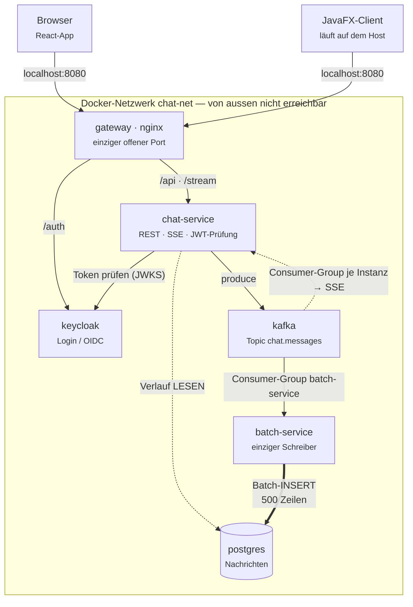
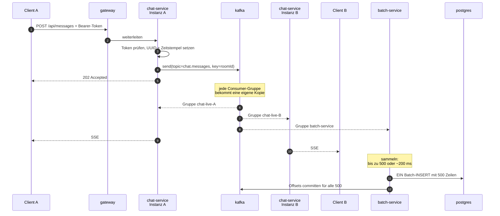
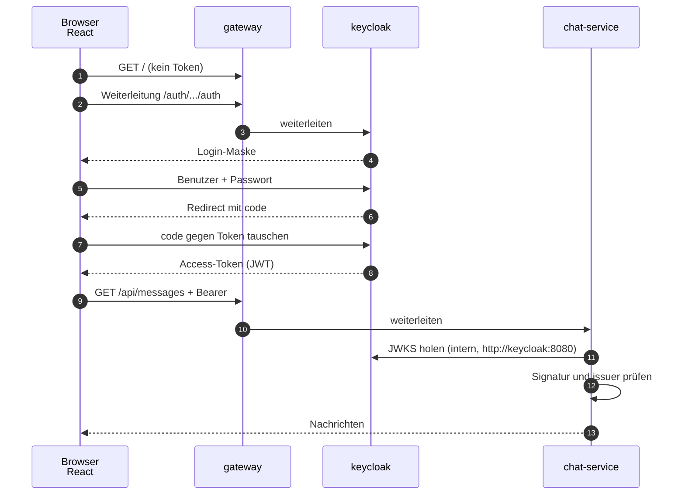

# Chat-App — Planung

Modul M321 (Verteilte Systeme / Microservices), Klasse IT3b.
Grundlage: die Skizze `docs/skizze-architektur.heic` (Stack + Blockdiagramm), erweitert um die Vorgaben
Keycloak, docker-compose, internes Docker-Netzwerk.

---

## 1. Stack

| Bereich | Entscheidung | Warum |
|---|---|---|
| Sprache | **Java 21** | Vorgabe aus der Skizze |
| Backend-Framework | **Spring Boot 3.x** | Bringt REST, SSE, Kafka-Client, OAuth2-Resource-Server und JPA mit, ohne Fremdbibliotheken |
| Web-UI | **React** (eigenes UI-Modul), Nachrichten per **SSE** | Eigenständig deploybarer Service — passt zum Modulthema Microservices |
| Desktop-UI | **JavaFX-Client** | Zweiter Client gegen dieselbe API, zeigt Client-Unabhängigkeit des Backends |
| Login | **Keycloak** (OIDC) | Vorgabe |
| Message Broker | **Apache Kafka** (KRaft-Modus, ohne ZooKeeper) | Industriell der Standard für Event-Streaming; Topics/Partitions/Consumer-Groups sind Lehrplan-Vokabular *(geändert — siehe Verlauf)* |
| Datenbank | **PostgreSQL** | Standard, gut dokumentiert. Schreibzugriff ausschliesslich gebündelt über den `batch-service` *(änderbar)* |
| Einstiegspunkt | **nginx** als Reverse Proxy | Einziger nach aussen offener Port |
| Betrieb | **docker-compose**, ein internes Netzwerk `chat-net` | Vorgabe |

## 2. Architektur



> Grafisch aufbereitete Fassung dieser Diagramme:
> [`docs/design/2026-08-28-chat-app-architektur.html`](docs/design/2026-08-28-chat-app-architektur.html)
> (lokal im Browser öffnen).

Alles unterhalb des Gateways liegt **ausschliesslich** im Docker-Netz `chat-net`.
Keiner dieser Container veröffentlicht einen Port auf den Host.

### 2.1 Die drei Services

**gateway (nginx)** — einziger offener Port `8080`.
Liefert das React-Bundle aus und leitet weiter:

| Pfad | Ziel im Docker-Netz |
|---|---|
| `/` | statisches React-Bundle |
| `/api/…` | `chat-service:8080` |
| `/stream` | `chat-service:8080` (SSE) |
| `/auth/…` | `keycloak:8080` |

**chat-service** — das Backend aus der Skizze. Aufgaben:
- REST-Endpunkt `POST /api/messages` — Nachricht entgegennehmen und **nur** auf das
  Kafka-Topic `chat.messages` schreiben (Schlüssel: `roomId`). Es schreibt selbst **nicht** in die
  Datenbank.
- `GET /api/messages?roomId=…` — Verlauf der letzten N Nachrichten aus der Datenbank **lesen**.
- `GET /stream` — SSE-Verbindung. Der Service liest per `@KafkaListener` in einer **eigenen,
  flüchtigen Consumer-Gruppe** vom Topic und schiebt jede eintreffende Nachricht in alle offenen
  SSE-Verbindungen dieser Instanz.
- **Raumverwaltung** — `POST /api/rooms` legt einen Raum an, `POST /api/rooms/{id}/members`
  lädt jemanden per Benutzernamen ein, `GET /api/rooms` listet die eigenen Räume.
  Diese drei schreiben **direkt** in die Datenbank, ohne Kafka und ohne Bündeln (Abschnitt 2.4).
- Prüft bei jedem Aufruf das JWT von Keycloak (OAuth2 Resource Server).

**batch-service** — läuft ohne Web-Oberfläche und **genau einmal** (eine Instanz). Er ist der
**einzige Dienst, der in die Nachrichtentabelle schreibt**:
- Liest fortlaufend als Consumer-Gruppe `batch-service` vom Topic `chat.messages` und schreibt
  **gebündelt** in die Datenbank (Details in Abschnitt 2.3). Das ist seine Hauptaufgabe.
- Zusätzlich zeitgesteuert (`@Scheduled`): Nachrichten älter als 30 Tage archivieren bzw. löschen,
  nächtliche Statistik (Nachrichten pro Raum, aktive Nutzer) in eine Tabelle schreiben.
- Meldet das Statistik-Ergebnis an Kafka, damit es im Chat als Systemmeldung erscheinen kann.

### 2.2 Nachrichtenfluss (der wichtigste Ablauf im Modul)

1. Der Client sendet `POST /api/messages` mit Bearer-Token an das Gateway.
2. Das Gateway leitet an `chat-service` weiter.
3. `chat-service` prüft das Token und mit **einer lesenden** Abfrage auf `room_member`, ob der
   Absender Mitglied des Raums ist (gebaut in Teilprojekt 2). Dann vergibt es eine UUID und einen
   Zeitstempel und schreibt die Nachricht mit `roomId` als **Schlüssel** auf das Topic
   `chat.messages`. Danach antwortet es dem Client. **Kein schreibender Datenbankzugriff im
   Anfrageweg** — gespeichert wird ausschliesslich im `batch-service`.
4. Am Topic hängen zwei Arten von Consumer-Gruppen — Kafka liefert jeder eigenen Gruppe eine
   vollständige Kopie des Topics, das übernimmt die Rolle, die bei RabbitMQ ein Fanout-Exchange
   hatte:
   - `chat-live-<zufällige-id>` — eine **eigene, flüchtige** Gruppe pro `chat-service`-Instanz.
     Startet immer bei `auto.offset.reset: latest`, liest also nie den Verlauf, sondern nur, was
     ab jetzt eintrifft. Für die Anzeige.
   - `batch-service` — eine einzige, **dauerhafte** Gruppe mit committeten Offsets. Für das
     Speichern.
5. Jede `chat-service`-Instanz schiebt ihre Kopie sofort über SSE an ihre Clients.
6. Der `batch-service` sammelt seine Kopien und schreibt sie gebündelt in PostgreSQL.

Schritt 4 ist der Grund für Kafka statt eines einfachen Punkt-zu-Punkt-Aufrufs — gleich zweifach:
**Verteilung** (bei zwei Backend-Instanzen sieht ein Nutzer an Instanz A auch Nachrichten von
Instanz B) und **Entkopplung** (die Anzeige wartet nicht auf die Datenbank).



### 2.3 Schreibpfad: warum gebündelt statt einzeln

**Das Problem.** Bei 100 000 Nachrichten pro Sekunde wären das 100 000 einzelne
`INSERT`-Anweisungen pro Sekunde. Jede davon kostet einen Netzwerk-Roundtrip zur Datenbank,
einen Parse-Vorgang und einen eigenen Transaktions-Commit. Die Datenbank ist damit lange vor
der Anwendung am Anschlag — und der Nutzer wartet beim Senden mit.

**Die Lösung.** Der `batch-service` sammelt, was aus der Consumer-Gruppe `batch-service`
hereinkommt, und schreibt in Paketen:

| Regel | Wert | Warum |
|---|---|---|
| Paketgrösse (Obergrenze) | 500 Nachrichten | Ein `INSERT` mit 500 Zeilen statt 500 Anweisungen |
| Wartezeit | ~200 ms | Damit auch bei wenig Betrieb nichts liegen bleibt |
| Ausgelöst durch | **was zuerst eintritt** | Voll oder Zeit abgelaufen — dann wird geschrieben |

Rechenbeispiel für die Klasse: 100 000 ÷ 500 = **200 Schreibvorgänge pro Sekunde** statt
100 000. Das ist Faktor 500 weniger Roundtrips, bei identischer Datenmenge.

**Wie das konkret gebaut wird:**
- Spring Kafka kann Consumer-seitig bündeln: `@KafkaListener(..., batch = "true")` liefert der
  Listener-Methode eine `List<Message>` statt einer einzelnen Nachricht.
- **Wichtig, ehrlich benannt:** Kafka kennt — anders als Spring AMQP bei RabbitMQ — keine
  deklarative Einstellung «500 Stück oder 200 ms». `max.poll.records: 500` ist nur eine
  **Obergrenze** pro Abholung, keine Mindestmenge; wie lange der Broker auf genug Daten wartet,
  bevor er antwortet, wird über `fetch.min.bytes` und `fetch.max.wait.ms: 200` angenähert.
  Das Ergebnis liegt nahe an «500 oder 200 ms», ist aber eine Annäherung über zwei getrennte
  Broker-Einstellungen, keine einzelne Garantie.
- Geschrieben wird mit `JdbcTemplate.batchUpdate(...)`. In der JDBC-URL muss
  `reWriteBatchedInserts=true` stehen, sonst schickt der PostgreSQL-Treiber die Zeilen trotzdem
  einzeln über die Leitung.
- **Offsets erst nach dem Commit.** `spring.kafka.listener.ack-mode: MANUAL` — der Listener
  committet die Offsets seiner Gruppe erst, nachdem `batchUpdate` erfolgreich war. Das ist die
  genaue Entsprechung zum «ACK erst nach dem Commit» bei RabbitMQ.

**Was dabei schiefgehen kann — und die Antwort darauf:**

| Risiko | Antwort |
|---|---|
| Absturz mitten im Paket → Nachrichten weg | **Offset-Commit erst nach dem Commit** der Datenbank-Transaktion. Ohne Commit liest die Gruppe beim nächsten Poll ab derselben Stelle erneut. |
| Erneute Zustellung → Nachricht doppelt in der DB | Die UUID kommt vom `chat-service` und ist der Primärschlüssel. `ON CONFLICT (id) DO NOTHING` verwirft die Dublette. |
| Reihenfolge | Zwei Gründe gemeinsam: der Zeitstempel wird im `chat-service` gesetzt, nicht von der Datenbank — und **Kafka garantiert Reihenfolge innerhalb einer Partition**. Weil `roomId` der Schlüssel ist, landen alle Nachrichten eines Raums garantiert in derselben Partition und damit in Sendereihenfolge. Über Räume hinweg gibt es keine Ordnungsgarantie — das ist unproblematisch, weil Räume unabhängig sind. |
| Datenbank kommt nicht nach | Der **Consumer-Lag** der Gruppe `batch-service` wächst — **sichtbar** über `kafka-consumer-groups.sh --describe --group batch-service` oder eine Kafka-UI. Genau das ist die Lehrstunde zu Backpressure. |

**Der Preis, ehrlich benannt.** Eine gesendete Nachricht steht bis zu ~200 ms später in der
Datenbank. Für die Anzeige spielt das keine Rolle — der SSE-Weg läuft völlig unabhängig und
ist sofort da. Nur wer in genau diesem Moment den Verlauf neu lädt, sieht die letzten
Millisekunden noch nicht. Das ist bewusst akzeptiert.

**Und die ehrliche Einordnung zur Zahl 100 000/s:** bei dieser Last wäre nicht mehr die
Datenbank der Engpass, sondern das Verteilen an die SSE-Verbindungen. Das Bündeln löst genau
ein Problem — das der Schreiblast. Es macht die App nicht automatisch skalierbar.

### 2.4 Rückstau: was passiert, wenn der Schreiber nicht nachkommt

Der `batch-service` läuft **einmal**. Eine Instanz ist damit die Obergrenze für den Durchsatz —
schafft sie 200 Pakete pro Sekunde, ist bei 100 000 Nachrichten pro Sekunde Schluss. Wird mehr
gesendet als geschrieben, wächst der **Consumer-Lag** der Gruppe `batch-service` — das ist kein
Fehler, das ist die Aufgabe eines Logs, das schneller geschrieben als gelesen werden darf. Drei
Fälle muss man aber auseinanderhalten, und hier unterscheidet sich Kafka am deutlichsten von
RabbitMQ:

| Fall | Was passiert | Was wir tun |
|---|---|---|
| **Kurzer Rückstau** — eine Lastspitze | Lag wächst und baut sich wieder ab | Nichts. Genau dafür ist der Puffer da. |
| **Dauerhafter Rückstau** — Datenbank langsam oder weg | Lag wächst unbegrenzt weiter | **Kafka blockiert `chat-service` beim Senden nicht von sich aus** — anders als RabbitMQ hat ein Topic keine Speichergrenze, die den Produzenten bremst. Der Log wächst, solange `retention.ms`/`retention.bytes` es zulassen. Ohne eigenes Zutun laufen alte, noch nicht gespeicherte Nachrichten irgendwann aus der Retention und sind **verloren** — genau das, was wir bei RabbitMQ ausdrücklich ausschliessen wollten. Der `batch-service` selbst wiederholt das Paket bei nicht erreichbarer Datenbank alle 5 Sekunden ohne Ende und bestätigt nichts — der Lag wächst sichtbar, auf seiner Seite geht nichts verloren. |
| **Giftnachricht** — eine einzelne Nachricht lässt sich nie schreiben | Ohne Offset-Commit liest der Consumer dieselbe Nachricht immer wieder | Der `batch-service` legt sie auf das Topic `chat.messages-dlt` (Grund im Header `error-reason`) und bestätigt. Kaputtes JSON geht sofort dorthin, eine von der Datenbank abgelehnte Zeile nach dem Einzelweg (siehe unten). Keine Wiederholungsschleife: diese Nachricht wird nie speicherbar. |

**Der ehrliche Unterschied zu RabbitMQ, ausdrücklich benannt.** RabbitMQ bremst überlastete
Producer automatisch (*Flow Control*) — Kafka nicht. Um dieselbe Garantie zu bekommen («lieber
sichtbar blockieren als still Nachrichten verlieren»), müsste `chat-service` den Consumer-Lag von
`batch-service` selbst beobachten (Kafka `AdminClient`, `describeConsumerGroups`) und
`POST /api/messages` ab einer Lag-Schwelle mit `503` ablehnen. Das ist **nicht eingebaut** und
noch nicht gebaut — siehe offener Punkt in Abschnitt 4. Bis dahin ist eine grosszügige Retention
auf `chat.messages` (z. B. 7 Tage) die einzige Absicherung: sie verschafft Zeit, verhindert den
Datenverlust aber nicht endgültig.

**Dieselbe Nachricht, zwei Consumer-Strategien, gegensätzliche Regeln.**

| Consumer-Gruppe | Wofür | Verhalten |
|---|---|---|
| `batch-service` | den Verlauf **speichern** | Dauerhaft, committete Offsets, nichts wird übersprungen. Holt nach einem Neustart genau dort weiter, wo sie aufgehört hat. |
| `chat-live-<instanz>` | jetzt **anzeigen** | Flüchtig, `auto.offset.reset: latest`, keine committeten Offsets. Startet nach jedem Neustart wieder bei «jetzt» — eine 30 Sekunden alte «Live»-Nachricht nachzuliefern wäre ohnehin wertlos. Wer etwas verpasst hat, holt es mit `GET /api/messages` nach. |

Das ist die Lehrstunde dieses Abschnitts, nur mit anderem Mechanismus als bei RabbitMQ: Wie man
mit demselben Datenstrom umgeht, hängt nicht an der Nachricht, sondern daran, **wozu** man sie
gerade braucht. Bei RabbitMQ war das eine Frage der Queue-Konfiguration (`x-max-length`,
`x-delivery-limit`); bei Kafka ist es eine Frage der Consumer-Gruppen-Strategie
(committete vs. nie committete Offsets).

**Ein Haken, der zum Bündeln gehört.** Lehnt die Datenbank eine einzige Zeile ab, scheitert das
ganze `batchUpdate` — alle 500. Antwort darauf: der `batch-service` schreibt dieses eine Paket dann
**einmalig Zeile für Zeile**. Nur die wirklich schuldige Zeile geht auf das Dead-Letter-Topic, die
restlichen 499 sind gespeichert; schon geschriebene Zeilen überspringt `ON CONFLICT`. Spring Kafkas
`@RetryableTopic` wäre hier keine Lösung: es wird für Batch-Listener gar nicht unterstützt (siehe
Nachtrag «batch-service»).

### 2.5 Login-Ablauf (Keycloak)

1. React erkennt: kein gültiges Token vorhanden → leitet den Browser auf
   `localhost:8080/auth/realms/chat/protocol/openid-connect/auth` (Authorization Code + PKCE).
2. Nutzer meldet sich bei Keycloak an, Keycloak leitet mit `code` zurück zur React-App.
3. React tauscht den `code` gegen ein Access-Token.
4. Jeder API-Aufruf trägt `Authorization: Bearer <token>`.
5. `chat-service` prüft die Signatur gegen den JWKS-Endpunkt von Keycloak — **intern** über
   `http://keycloak:8080`, ohne den Host zu berühren.

Der JavaFX-Client macht denselben Ablauf mit einem eingebetteten Browserfenster oder dem
Device-Authorization-Flow.



### 2.6 Docker-Compose — Ports und Netzwerk

```yaml
# Skizze, nicht die fertige Datei
services:
  gateway:       { ports: ["8080:80"], networks: [chat-net] }   # einziger offener Port
  chat-service:  { expose: ["8080"],   networks: [chat-net] }
  batch-service: {                     networks: [chat-net] }
  keycloak:      { expose: ["8080"],   networks: [chat-net] }
  kafka:         { expose: ["9092"],   networks: [chat-net] }   # KRaft-Modus, kein ZooKeeper-Container
  postgres:      { expose: ["5432"],   networks: [chat-net] }
networks:
  chat-net: { driver: bridge }
```

Merksatz für die Prüfung: `expose` macht einen Port **nur im Docker-Netz** sichtbar,
`ports` veröffentlicht ihn auf dem Host. Genau ein `ports`-Eintrag ist erlaubt.
Die Services erreichen einander über ihren **Service-Namen** als Hostname (`chat-service`,
`kafka`, …) — das übernimmt Dockers interner DNS.

## 3. Datenmodell (Entwurf)

```
room
  id          UUID        PK
  name        VARCHAR          Anzeigename, vom Ersteller vergeben
  created_by  VARCHAR          Benutzername des Erstellers
  created_at  TIMESTAMPTZ

room_member
  room_id     UUID        PK   zusammengesetzter Schlüssel aus beiden Spalten,
  username    VARCHAR     PK   damit dieselbe Person nicht doppelt drinsteht
  invited_by  VARCHAR          wer eingeladen hat
  joined_at   TIMESTAMPTZ

message
  id          UUID        PK   -- kommt vom chat-service, NICHT von der Datenbank
  room_id     UUID        FK   -> room.id
  sender      VARCHAR          Benutzername aus dem Token ("preferred_username")
  text        TEXT
  sent_at     TIMESTAMPTZ      vom chat-service gesetzt, nicht per DEFAULT now()
```

**Räume und Mitglieder** (entschieden nach der ersten Fassung): Wer einen Raum anlegt, ist
sofort Mitglied. Jedes Mitglied darf weitere Personen **per Benutzername** einladen; wer
eingeladen wird, ist damit sofort Mitglied — es gibt keine Einladung zum Annehmen. Das ist die
einfachste Regel, die funktioniert, und sie lässt sich später um einen Status erweitern.

Bei `POST /api/messages` und `GET /api/messages` prüft der `chat-service` mit **einer** Abfrage
auf `room_member`, ob der Benutzername aus dem Token in diesem Raum überhaupt Mitglied ist.
Genau dafür liegt die Mitgliedertabelle bei uns und nicht in Keycloak: Keycloak weiss, **wer**
jemand ist — nicht, **wo** er mitlesen darf.

Zwei Details hängen direkt am Bündeln aus Abschnitt 2.3:

- **Die UUID vergibt der `chat-service`**, bevor er sie publiziert. Nur so kann der Schreibvorgang
  gefahrlos wiederholt werden: `INSERT … ON CONFLICT (id) DO NOTHING` verwirft eine erneut
  zugestellte Nachricht. Eine von der Datenbank vergebene ID (`SERIAL`) würde bei jedem
  Wiederholungsversuch eine neue Zeile erzeugen — die Nachricht stünde doppelt im Chat.
- **Den Zeitstempel setzt ebenfalls der `chat-service`.** Ein `DEFAULT now()` in der Datenbank
  würde den Moment des Schreibens festhalten, nicht den des Sendens — bei einem Paket von 500
  Nachrichten hätten alle exakt dieselbe Zeit.

Benutzer werden **nicht** in der eigenen Datenbank gehalten — dafür ist Keycloak zuständig.
Gespeichert wird nur der Benutzername als Absender.

## 4. Offene Punkte

1. **Keycloak-Issuer hinter dem Proxy.** Der Browser sieht Keycloak als
   `localhost:8080/auth`, `chat-service` intern als `keycloak:8080`. Stimmen die Werte nicht
   überein, passt das `iss`-Feld im Token nicht zur erwarteten Issuer-URL und die Prüfung
   schlägt fehl. Lösung: `KC_HOSTNAME` auf die öffentliche URL setzen. **Muss getestet werden.**
2. **SSE und der Authorization-Header.** Das native `EventSource` im Browser kann **keine**
   eigenen Header senden. Varianten: Token als Query-Parameter (unschön, landet im Log),
   ein kurzlebiges Ticket vor dem Verbindungsaufbau, oder `fetch`-basiertes SSE. Zu entscheiden.
3. **Paketgrösse und Wartezeit** — gemessen am 2026-09-11 (einzeln) und 2026-09-12 (gebündelt),
   `docs/messungen/2026-09-11-einzeln-vs-paket.md`: einzeln 862 Nachrichten/s, gebündelt
   14 285 Nachrichten/s, mit `max.poll.records: 500`, `fetch.max.wait.ms: 200`,
   `fetch.min.bytes: 100 KB`. Erneut nachmessen, sobald die Dienste im Compose laufen
   (Teilprojekt 4).
4. **Kein automatisches Backpressure auf den Sender.** Anders als RabbitMQ blockiert Kafka
   `chat-service` beim Senden nicht von sich aus, wenn `batch-service` dauerhaft nicht nachkommt
   (Abschnitt 2.4). Um «sichtbar blockieren statt still verlieren» zu erreichen, müsste
   `chat-service` den Consumer-Lag von `batch-service` selbst prüfen und ab einer Schwelle mit
   `503` antworten. **Noch nicht gebaut.**
5. **Einzelweg nach einem fehlgeschlagenen Paket** — erledigt im `batch-service` (Teilprojekt 1,
   Abschnitt 2.4).
6. **Existiert der eingeladene Benutzername überhaupt?** Beim Einladen prüfen wir vorerst
   **nicht** gegen Keycloak. Ein Tippfehler legt dann eine Mitgliedschaft für jemanden an, den
   es nicht gibt — harmlos, aber unschön. Später über die Keycloak-Admin-API prüfbar.
7. **Kafka-UI im Unterricht.** Eine Oberfläche wie Kafka UI zeigt Topics, Partitionen und
   Consumer-Lag — praktisch für die Backpressure-Lehrstunde. Sie läge auf einem eigenen Port und
   wäre laut Vorgabe nicht erreichbar. Entweder über das Gateway proxien oder für Demos bewusst
   freigeben.
8. **Zweite chat-service-Instanz** (gestrichelter Kasten in der Skizze) — geplant, aber noch
   nicht entschieden, ob sie Teil der Abgabe ist. Mit Kafka braucht jede Instanz nur eine eigene,
   eindeutige Consumer-Gruppen-ID für die Live-Anzeige — einfacher als eine eigene, exklusive
   Queue am Fanout-Exchange, wie es bei RabbitMQ nötig gewesen wäre.
9. **Nachrichtenverlust beim Reconnect.** Fällt die SSE-Verbindung kurz aus, fehlen Nachrichten
   (die flüchtige Consumer-Gruppe der Instanz beginnt ohnehin immer bei «jetzt», holt also nichts
   nach). Geplant: nach dem Reconnect den Verlauf per `GET /api/messages` nachladen.
10. **JavaFX-Client und Docker.** Der Client läuft auf dem Host, nicht im Compose. Er nutzt
    `localhost:8080` wie der Browser — die Port-Regel bleibt damit eingehalten.
11. **Raum verlassen, Mitglied entfernen, Raum löschen** — geplant ist bisher nur anlegen und
    einladen. Was mit den Nachrichten passiert, wenn ein Raum gelöscht wird, ist offen.
12. **Rollen in Keycloak** (z. B. `user`, `moderator`) — noch nicht festgelegt. Eine Rolle
    `moderator` wäre die naheliegende Stelle, um das Einladen einzuschränken.

## 5. Nächste Schritte

Umgesetzt: Infrastruktur (Postgres, Kafka mit Volume), `chat-service` mit Lesen und Senden
(`docs/plan/2026-09-04-chat-service-bootstrap.md`), `batch-service` mit Einzel- und Paketstufe
(`docs/plan/2026-09-11-batch-service.md`).

Weiter in dieser Reihenfolge (entschieden am 2026-09-11), jedes Teilprojekt mit eigenem Design,
Plan und Umsetzung:

1. **Räume und Mitgliedsprüfung** — die Tabellen `room` und `room_member` gibt es schon; dazu die
   drei Endpunkte und die lesende Mitgliedsprüfung beim Senden und Lesen.
2. **Live-Anzeige per SSE** — `GET /stream`, jede `chat-service`-Instanz mit eigener, flüchtiger
   Consumer-Gruppe (`auto.offset.reset: latest`).
3. **Gateway und React-Oberfläche** — nginx als einziger offener Port; `chat-service` und
   `batch-service` wandern ins Compose, die veröffentlichten Ports werden zu `expose`.
4. **Keycloak-Login** — Realm-Import, Token-Prüfung, Absender aus dem Token statt aus dem Request.
5. **Zeitgesteuerte Aufgaben** im `batch-service` (Archivierung, Statistik) und **JavaFX-Client**.

---

## Verlauf

*Dieser Abschnitt ist von der KI (Claude) geschrieben und hält den Planungsweg fest.*

### Fragen, die ich gestellt habe

1. **Womit soll die Web-App gebaut werden?** — Ich hatte Thymeleaf + SSE empfohlen, weil es
   ohne npm auskommt und jede Zeile im Unterricht erklärbar ist.
2. **Welcher Message Broker?** — RabbitMQ, Kafka oder ActiveMQ Artemis.
3. **Wie fein soll geschnitten werden?** — 2, 3 oder 4–5 Services.
4. **Ist ein Desktop-Client im Scope?** — Ich hatte davon abgeraten.
5. **Nachfrage nach der Desktop-Antwort:** Wie lösen wir den Zugriff des JavaFX-Clients,
   ohne die Regel "nur die Web-App ist über Localhost erreichbar" zu brechen?

### Wo umentschieden wurde

- **Web-UI: mein Vorschlag wurde verworfen.** Ich hatte Thymeleaf empfohlen und dabei das
  Modulziel falsch gewichtet: M321 lehrt verteilte Systeme und Microservice-Architektur.
  Ein server-gerendertes Template im Backend hätte UI und Backend zusammengezogen — genau
  das Gegenteil der Lernaufgabe. Entschieden wurde **React als eigenes UI-Modul**, das
  separat deployt wird, plus SSE für die Live-Nachrichten. Das ist die richtige Entscheidung.
- **Desktop-Client: von "nein" auf "ja".** Ich hatte abgeraten, weil ein zweiter Client einen
  zweiten offenen Port zu brauchen scheint. Die Entscheidung fiel auf "ja" — und zwang mich
  zu einer besseren Lösung: ein Gateway als einziger Einstiegspunkt. Beide Clients nutzen
  denselben Port. Der Widerspruch, den ich als Ausschlussgrund gesehen hatte, war keiner.
- **RabbitMQ wurde nicht einfach akzeptiert**, sondern begründet nachgefragt. Die Begründung
  (sichtbare Queues in der Management-UI, Lehrplan-Vokabular Exchange/Queue/ACK, wenig Code,
  leichtgewichtig im Compose) hat gehalten — bis zum späteren Wechsel auf Kafka, siehe Nachtrag
  unten. Das Gegenargument von damals (Kafka wäre industriell relevanter für Datenströme) ist
  genau der Grund, aus dem es später doch gewählt wurde.

### Verworfene Varianten

| Verworfen | Grund |
|---|---|
| Thymeleaf + SSE als Web-UI | Zieht UI und Backend zusammen, widerspricht dem Modulziel |
| Vaadin Flow | Zu viel Framework-Magie, für Lernende nicht Zeile für Zeile erklärbar |
| RabbitMQ | Ursprünglich gewählt (sichtbare Queues, wenig Code) — später zugunsten von Kafka verworfen, siehe Nachtrag «Wechsel von RabbitMQ zu Kafka» |
| ActiveMQ Artemis | Weniger verbreitet, keine gleichwertige sichtbare Oberfläche |
| 2 Services (Web + Backend zusammen) | Zeigt zu wenig verteilte Kommunikation |
| 4–5 Services (user-, notification-service) | Mehr Boilerplate pro Feature als Lernwert |
| Zweiter offener Port fürs Backend | Verletzt die Vorgabe direkt |
| Spring Cloud Gateway statt nginx | Ein weiterer Spring-Service mit eigener Konfiguration; nginx sind zehn Zeilen Config |
| Desktop-Client ganz weglassen | Als offener Punkt zu wenig — die Gateway-Lösung macht ihn ohne Regelbruch möglich |

### Was ich ohne Rückfrage entschieden habe

PostgreSQL als Datenbank, Spring Boot als Framework, ein Topic statt getrennter Themen pro
Zweck, und die Aufgaben des batch-service. Alles ist ohne Umbau der Architektur austauschbar —
darum keine Frage, sondern eine Festlegung, die man überstimmen kann.

### Nachtrag — Diagramme

Die ASCII-Skizze im Abschnitt Architektur wurde durch **Mermaid**-Diagramme ersetzt (Container-
Übersicht, Nachrichtenfluss, Login). Mermaid rendert direkt in GitHub und IntelliJ, bleibt aber
als Text im Repo — man sieht im Diff, was sich geändert hat. Zusätzlich liegt eine grafisch
aufbereitete Fassung unter `docs/design/2026-08-28-chat-app-architektur.html`; die Datei ist
lokal und benötigt keine Internetverbindung, weil `mermaid.min.js` daneben liegt.

### Nachtrag — Schreiblast (Vorgabe kam nach der ersten Fassung)

In der ersten Fassung schrieb der `chat-service` jede Nachricht sofort selbst in die Datenbank
und publizierte sie erst danach. Die Vorgabe, auf 100 000 Nachrichten pro Sekunde zu denken,
hat diesen Weg gekippt: 100 000 einzelne `INSERT`-Anweisungen pro Sekunde sind kein
Datenbankproblem mehr, sondern ein Architekturfehler.

**Was sich geändert hat:** der `chat-service` schreibt gar nicht mehr. Er publiziert nur noch,
und der `batch-service` — bisher nur ein nächtlicher Aufräumdienst — ist zum einzigen Schreiber
geworden und bündelt (Abschnitt 2.3). Damit hat der Broker eine zweite Aufgabe bekommen: er
verteilt nicht nur, er entkoppelt auch die Anzeige von der Datenbank.

**Verworfen wurde dabei:**

| Verworfen | Grund |
|---|---|
| `chat-service` schreibt einzeln, `batch-service` räumt nur auf | Genau der Fall, den die Vorgabe ausschliesst |
| Sammelpuffer im `chat-service` selbst | Bei mehreren Instanzen schreiben mehrere Dienste gleichzeitig; ausserdem ist der Puffer bei einem Neustart weg, weil er nicht dauerhaft gespeichert ist |
| Nur nach Anzahl bündeln (ohne Zeitlimit) | Bei wenig Betrieb bleiben Nachrichten beliebig lange liegen |
| Nur nach Zeit bündeln (ohne Obergrenze) | Bei einem Lastspitze wird ein einzelnes Paket beliebig gross |
| ID und Zeitstempel von der Datenbank vergeben lassen | Macht das Wiederholen eines Pakets unmöglich und verfälscht die Sendezeit |

**Was ich dabei ohne Rückfrage festgelegt habe:** die Werte 500 Nachrichten und ~200 ms. Beide
sind Startwerte und stehen als offener Punkt Nr. 3 zum Nachmessen drin.

**Was ich einordnen muss, auch wenn es nicht gefragt war:** bei echten 100 000 Nachrichten pro
Sekunde wäre der Engpass nicht mehr die Datenbank, sondern das Verteilen an die
SSE-Verbindungen. Das Bündeln löst die Schreiblast — nicht die Skalierung insgesamt.

### Nachtrag — Rückstau, Räume und die Zahl der Schreiber

Drei offene Punkte wurden entschieden, zwei davon per Vorgabe, einer auf meinen Vorschlag hin.

**Vorgegeben:**

- **Der `batch-service` läuft vorerst genau einmal.** Damit ist die Frage nach Competing
  Consumers vom Tisch — und ehrlicherweise ist eine Instanz die saubere Reihenfolge zum Lernen:
  erst sehen, wo die Grenze einer Instanz liegt, dann über eine zweite reden.
- **Räume legt ein Nutzer selbst an und lädt per Benutzername ein.** Ich habe daraus die
  einfachste Form gemacht, die trägt: eingeladen heisst sofort Mitglied, kein Annehmen. Und
  zwei Tabellen statt einer, weil die Mitgliedschaft die Zugriffsprüfung ist.

**Auf Nachfrage vorgeschlagen — was bei einem Rückstau vor dem Speichern passieren soll:**
nichts wegwerfen, sondern blockieren. Die Begründung steht (damals wie heute) in Abschnitt 2.4;
kurz: eine Nachricht, die noch nicht gespeichert ist, **ist** der zukünftige Verlauf, und ein
Verlauf mit stillen Löchern ist schlimmer als ein Chat, der sichtbar streikt. Dazu eine
Dead-Letter-Ablage, aber ausdrücklich nur für Nachrichten, die sich **nie** schreiben lassen —
nicht für zu viele auf einmal. Diese beiden Fälle werden regelmässig verwechselt.

Der Gewinn dabei war nicht die Entscheidung selbst, sondern der Vergleich: die Live-Anzeige
bekommt die **gegenteilige** Regel (nichts nachliefern, immer bei «jetzt» beginnen), obwohl
dieselbe Nachricht drinsteht. Das macht sichtbar, dass Überlaufverhalten am Zweck hängt, nicht
an den Daten. (Mit RabbitMQ war das eine Frage der Queue-Konfiguration; mit Kafka ist es eine
Frage der Consumer-Gruppen-Strategie — siehe Nachtrag «Wechsel von RabbitMQ zu Kafka».)

**Verworfen:**

| Verworfen | Grund |
|---|---|
| Nachrichten vor dem Speichern grosszügig verwerfen, statt zu blockieren | Löscht still Nachrichten aus dem Verlauf; niemand merkt es |
| Unbegrenzt laufen lassen und nur beobachten | Ohne Grenze fällt irgendwann der Broker aus — und mit ihm auch der Live-Chat |
| Einladung mit Annehmen/Ablehnen | Zwei Zustände mehr, für die Aufgabenstellung kein Gewinn |
| Mitgliedschaften als Keycloak-Gruppen | Bindet die Fachlogik an den Login-Dienst und braucht die Admin-API für jede Einladung |
| Raum als reines Textfeld an der Nachricht (erste Fassung) | Kein Ort für Mitglieder, keine Zugriffsprüfung möglich |

**Was ich dabei ohne Rückfrage festgelegt habe:** die konkreten Zahlen (damals RabbitMQ-Werte,
heute `max.poll.records`/`fetch.max.wait.ms`) — Startwerte wie 500/200 ms, gehören nachgemessen.

### Nachtrag — Sprache im Code

Der Code ist **englisch**, die Erklärung **deutsch**: Klassen, Methoden, Variablen, Tabellen- und
Spaltennamen, JSON-Felder und Query-Parameter auf Englisch; Kommentare, Log-Ausgaben,
Fehlermeldungen und alle Swagger-Beschreibungen auf Deutsch.

Die erste Fassung dieses Dokuments hatte deutsche Spaltennamen (`raum`, `absender`, `gesendet_am`)
und der erste Implementierungsplan entsprechend deutsche Bezeichner. Der Grund für den Wechsel:
Java, Spring und SQL bringen ihr eigenes englisches Vokabular mit (`get`, `find`, `Repository`,
`SELECT`, `ORDER BY`). Mischt man deutsche Bezeichner darunter, entstehen Wortungetüme wie
`findeLetzteNachrichtenByRaumId` — halb Deutsch, halb Englisch, in beiden Sprachen falsch.

Bezeichner folgen also der Sprache der Werkzeuge, die Erklärung folgt der Sprache des Unterrichts.
Das Datenmodell oben ist entsprechend umbenannt (`room`, `room_member`, `sender`, `sent_at`), die
Raum-Endpunkte heissen `/api/rooms`.

### Nachtrag — Wechsel von RabbitMQ zu Kafka

Der Broker wurde von RabbitMQ auf **Apache Kafka** umgestellt. Anders als bei den bisherigen
Nachträgen kam der Anstoss diesmal **nicht** aus einer neuen Vorgabe, sondern aus eigenem
Wunsch: Kafka ist industriell der verbreitetere Standard für Event-Streaming, und genau dieses
Argument stand schon in der ursprünglichen Entscheidung als Gegenposition (Abschnitt "Wo
umentschieden wurde").

**Warum das mehr war als Namen ersetzen.** RabbitMQ und Kafka bilden dieselbe Rolle im System —
ein Broker zwischen `chat-service` und `batch-service` — mit **unterschiedlichen Bausteinen**
ab. Exchange/Queue/ACK lassen sich nicht 1:1 auf Topic/Partition/Offset übertragen, deshalb wurde
Abschnitt 2 neu durchdacht, nicht nur umbenannt:

| RabbitMQ-Konzept | Kafka-Entsprechung | Was sich dadurch ändert |
|---|---|---|
| Ein Fanout-Exchange verteilt an alle gebundenen Queues | Ein Topic verteilt automatisch eine volle Kopie an jede **eigene Consumer-Gruppe** | Aus zwei Queue-Typen (`chat.live.*`, `chat.persist`) wird **ein** Topic mit zwei Consumer-Gruppen-Strategien — eine Vereinfachung |
| `chat.live.<instanz>` mit `x-max-length`/TTL, damit Alt-Nachrichten verworfen werden | Flüchtige Consumer-Gruppe je Instanz, `auto.offset.reset: latest`, nie committete Offsets | Statt Nachrichten aktiv zu verwerfen, werden sie strukturell nie zweimal gelesen — kein Wegwerf-Mechanismus mehr nötig |
| `chat.persist` als dauerhafte Queue, ACK erst nach Commit | Dauerhafte Consumer-Gruppe `batch-service`, Offset-Commit erst nach Commit | Gleiches Prinzip, andere Mechanik |
| RabbitMQ bremst überlastete Producer automatisch (Flow Control) | **Kein eingebautes Gegenstück.** Kafka ist ein retention-basierter Log, kein grössenbegrenzter Speicher, der den Sender bremst | Echter Funktionsverlust — siehe unten |
| Quorum-Queue mit `x-delivery-limit`, Dead-Letter-Queue | `@RetryableTopic` (nicht-blockierende Wiederholung) mit Dead-Letter-**Topic** | Vergleichbares Ergebnis, anderer Baustein |
| Reihenfolge nur über den vom Sender gesetzten Zeitstempel | Zusätzlich: Kafka garantiert Reihenfolge **innerhalb einer Partition** — `roomId` als Schlüssel sichert Reihenfolge pro Raum strukturell | Eine echte Verbesserung gegenüber der RabbitMQ-Fassung |

**Was ehrlich schlechter geworden ist, nicht nur anders.** Der wichtigste Punkt: RabbitMQs
automatische Flow Control — «Sender wird gebremst, `POST /api/messages` antwortet mit 503, statt
dass irgendwo still Nachrichten verloren gehen» — hat **kein eingebautes Kafka-Gegenstück**. Ein
Topic wächst gemäss Retention weiter, unabhängig davon, ob `batch-service` mitkommt. Das ist als
neuer offener Punkt Nr. 4 aufgenommen, nicht stillschweigend übergangen: um dieselbe Garantie zu
bekommen, muss `chat-service` künftig selbst den Consumer-Lag von `batch-service` prüfen und ab
einer Schwelle ablehnen. Bis das gebaut ist, schützt nur eine grosszügige Retention-Zeit vor
Datenverlust — und auch die nur vorübergehend.

Zweiter Preis: die «500 oder 200 ms»-Regel liess sich bei RabbitMQ als **eine** Einstellung
ausdrücken (`setConsumerBatchEnabled` + `setBatchSize` + `setReceiveTimeout`). Bei Kafka ist das
eine **Annäherung** über zwei getrennte Broker-Einstellungen (`fetch.min.bytes`,
`fetch.max.wait.ms`) plus eine Client-seitige Obergrenze (`max.poll.records`) — weniger exakt,
aber näher an dem, was in echten Kafka-Systemen tatsächlich gemacht wird.

**Was gleich geblieben ist.** UUID und Zeitstempel weiterhin vom `chat-service` gesetzt,
`ON CONFLICT (id) DO NOTHING` zur Deduplizierung, `JdbcTemplate.batchUpdate` zum Schreiben, genau
eine `batch-service`-Instanz, das gesamte Datenmodell (Abschnitt 3), die Raumverwaltung, der
Login-Ablauf über Keycloak (Abschnitt 2.5) und die Docker-Netzwerk-Regeln. Der Wechsel betrifft
ausschliesslich den Broker und alles, was direkt an seinen Bausteinen hängt.

**Verworfen bei diesem Wechsel:**

| Verworfen | Grund |
|---|---|
| Zwei separate Topics (`chat.live`, `chat.persist`) analog zu den RabbitMQ-Queues | Unnötig — Kafkas Fanout-pro-Consumer-Gruppe leistet das bereits mit einem einzigen Topic |
| So tun, als hätte Kafka dieselbe automatische Backpressure wie RabbitMQ | Wäre unehrlich — der Unterschied ist real und steht jetzt als offener Punkt Nr. 4 |
| ZooKeeper mit einplanen | Modernes Kafka läuft im KRaft-Modus ohne ZooKeeper — ein Container weniger im Compose |

**Was ich ohne Rückfrage festgelegt habe:** die Aufteilung in eine flüchtige Gruppe pro Instanz
(Live-Anzeige) und eine dauerhafte Gruppe (`batch-service`), `roomId` als Partitionsschlüssel,
und den Umgang mit Giftnachrichten über `@RetryableTopic`. Alle drei sind ohne Umbau der
Architektur änderbar.

### Nachtrag — batch-service (Teilprojekt 1)

Der `batch-service` ist gebaut, nach dem Design
`docs/superpowers/specs/2026-09-11-batch-service-design.md` und dem Plan
`docs/plan/2026-09-11-batch-service.md`. Drei Punkte dieses Dokuments haben sich dabei geändert:

- **Die Raumprüfung beim Senden ist erlaubt.** Abschnitt 2.2 verbot «Datenbank im Anfrageweg»,
  Abschnitt 3 verlangte eine Abfrage auf `room_member` beim Senden — ein Widerspruch. Entschieden:
  gemeint war nur **schreibender** Zugriff. Eine lesende, per Index schnelle Abfrage ist erlaubt und
  verhindert, dass jemand in fremde oder nicht existierende Räume schreibt. Gebaut wird sie in
  Teilprojekt 2; bis dahin fängt der `batch-service` Nachrichten für unbekannte Räume über das
  Dead-Letter-Topic ab — und behält das auch danach als Sicherheitsnetz.
- **`@RetryableTopic` war falsch.** Spring Kafka unterstützt die nicht-blockierende Wiederholung
  nicht für Batch-Listener. Ersetzt durch eigenen, lesbaren Code: drei Fehlerklassen (kaputte
  Nachricht, abgelehnte Zeile, Infrastruktur weg), Einzelweg nach einem abgelehnten Paket, endlose
  Wiederholung alle 5 Sekunden bei nicht erreichbarer Datenbank.
- **Neue Reihenfolge der Teilprojekte.** Die React-Oberfläche kommt vor Keycloak, damit früher etwas
  Klickbares da ist; Keycloak ersetzt danach das vorläufige Absenderfeld.

Gemessen (`docs/messungen/2026-09-11-einzeln-vs-paket.md`): einzeln 862 Nachrichten/s, gebündelt
14 285 Nachrichten/s — rund 17-mal schneller; die Datenbank ist damit nicht mehr der Engpass.

**Bei der Handprüfung aufgefallen:** Bei nicht erreichbarer Datenbank wiederholte der
`batch-service` zwar korrekt und verlor nichts, schrieb aber keine einzige Zeile ins Log — Spring
wiederholt still, man sah den Ausfall nur am Lag. Das Design verlangte eine `ERROR`-Zeile pro
Versuch; sie ist nachgerüstet («Datenbank nicht erreichbar (…) - Paket mit … Nachrichten wird
wiederholt»).

**Was ich ohne Rückfrage festgelegt habe:** `spring-boot-starter-json` als zusätzliche Abhängigkeit
(ohne Web-Starter fehlt sonst der `ObjectMapper`), ein Volume für Kafka und
`KAFKA_AUTO_CREATE_TOPICS_ENABLE=false` im Compose, 5 Sekunden Wartezeit zwischen zwei Versuchen,
keine ausdrückliche Transaktion um ein Paket (`ON CONFLICT` macht das Wiederholen ungefährlich).
